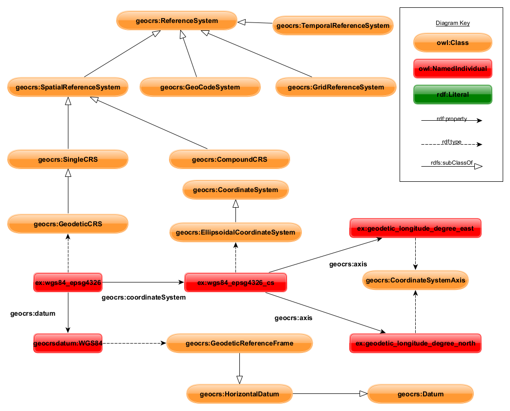

# Proj4RDF - Representing spatial reference systems in RDF
   
This repository contains the following data:
* An ontology draft for representing spatial reference systems in RDF
* A converted dataset of spatial reference systems present in the pyproj4 library in RDF
* A converted set of more than 4000 interstellar geoids for the use for spatial reference systems in RDF
* An extraction script from pyproj definitions to RDf
* Initial SHACL rules for the validation of spatial reference systems in RDF
* Testdata showing how different types of spatial objects can be modeled using the new ontology model
* Extension of the Apache Jena library for the new ontology model
   
## GeoSPARQL SRS ontology draft 

The GeoSPARQL SRS ontology draft contains classes for the following components of a spatial reference system:
* Coordinate Systems
* Coordinate System Axis
* Coordinate Operations
* Area of Use
* Datum types
* Geoid
* Spatial reference system appplications
* Spatial reference system registry
* Interstellar bodies



The ontology documentation is automatically generated as part of this repository as a Github pages:
Ontology Documentation: https://situx.github.io/proj4rdf/ as owl/ontology.ttl in this repository and visually represented using [WebVOWL](http://www.visualdataweb.de/webvowl/#iri=https://raw.githubusercontent.com/situx/proj4rdf/master/owl/ontology.ttl)

### Example CRS data

To apply the ontology model, the PROJ4 library in the form of pyproj has been extracted and modelled in the new ontology model.
In addition, more than 4000 geoids of interstellar bodies have been added to the ontology model.

Example Data with PROJ4: https://situx.github.io/proj4rdf/index2.html as owl/result.ttl in this repository and visually represented using [WebVOWL](http://www.visualdataweb.de/webvowl/#iri=https://raw.githubusercontent.com/situx/proj4rdf/master/owl/result.ttl)

The example data can be generated using the Python script available in this repository: epsg2ttl.py

### SHACL rules

A set of SHACL rules to verify a well-defined coordinate reference system has been added to this repository. The SHACL rules are a minimum set of rules which might be extended in a further process.

```
geocrs:CoordinateSystemShape rdf:type sh:NodeShape, owl:Class ;
sh:targetNode geocrs:CoordinateSystem ;
       sh:property [
           sh:path geocrs:axis  ;
		   sh:class geocrs:CoordinateSystemAxis ;
           sh:minCount 1 ;
       ] .
```

SHACL rules: owl/rules.ttl  https://situx.github.io/proj4rdf/rules.html  [WebVOWL](http://www.visualdataweb.de/webvowl/#iri=https://raw.githubusercontent.com/situx/proj4rdf/master/owl/rules.ttl)

## Apache Jena extension documentation

The repository also includes an in-development Java application which is an extension of the Apache Jena GeoSPARQL library.
The library has been extended by new functions for coordinate conversion and by conversion classes from RDF to WKT.

Source Code Documentation: https://situx.github.io/proj4rdf/html/
